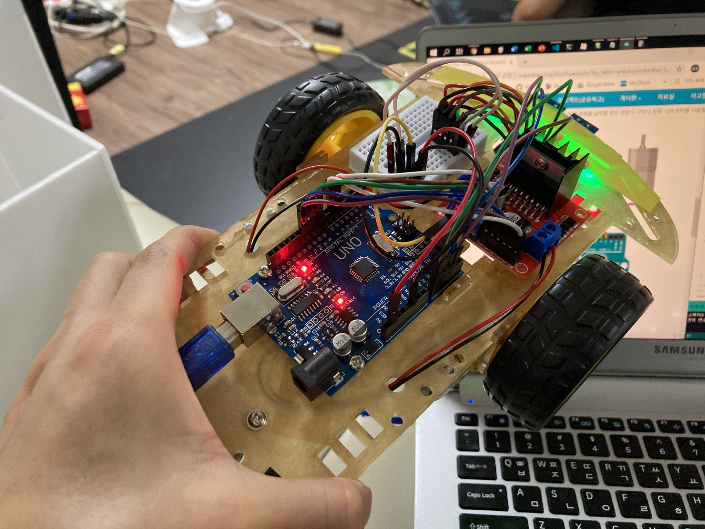

# 아두이노를 이용한 라인트레이서

아두이노와 시중에 나와있는 모듈들(IR 센서, 모터, 모터 드라이버)을 활용한 간단한 라인트레이서이다.

## 사용 부품

| 부품                        | 모델명            | 개수  | 참고                                                         |
| --------------------------- | ----------------- | ----- | ------------------------------------------------------------ |
| 개발 보드                   | Arduino Uno       | 1개   | ATmega328P (16MHz 8-bit Microprocessor)                      |
| IR 센서 (수광 및 발광) 모듈 | TCRT5000 (Module) | 4개   | [구매 링크](http://auction.kr/iBPuXqF)                       |
| 모터 드라이버               | L298N (Module)    | 1개   | [구매 링크](https://smartstore.naver.com/kitplus/products/4388409857) / Dual H-Bridge |
| 2wd RC car 프레임 스마트카  |                   | 1세트 | [구매 링크](https://smartstore.naver.com/kitplus/products/4437219694) / **프레임, 기어드 DC 모터와 바퀴 한 쌍 포함** |

위의 부픔 외에 브레드 보드와 점퍼선이 필요하다. 추가적으로 글루건이 있으면 부품을 프레임에 붙이기 용이하다.

## 회로도

## 기능
* 시리얼 통신을 이용해 라인트레이서와 상호작용할 수 있는 기능
* 센서값 캘리브레이션
  - 센서마다 특성이 모두 다르므로 모든 센서가 똑같은 기준에 의해 동작될 수 있도록 캘리브레이션을 진행해야한다.
* 밝은 색상의 선을 따라 앞으로 나아가는 기능 (직선, 곡선 주행)