# Week 1

아래의 움짤은 아두이노 라인트레이서 프로젝트의 프로토타입이다.

<center>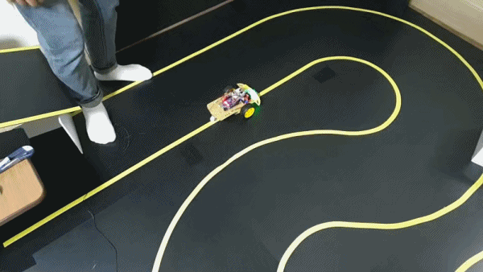</center>


## 라인트레이서를 시작하기 전에

라인트레이서란 정해진 라인을 보고 따라가는 로봇이다. 사람이 직접 로봇을 조작하는 것이 아닌, 라인을 스스로 보고 주행하기 때문에 여러 분야에서 사용될 수 있다<del>(움직이는 쓰레기통도 만들 수 있고)</del>.

<center>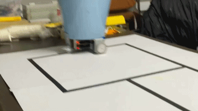</center>

물류 창고에서 바닥에 그려진 라인을 따라 물건을 운반하는 데 사용하거나 단거리 자율주행 자동차의 구현체가 될 수 있다. 이러한 라인트레이서를 만들기 위해 MCU를 사용하여 주변 하드웨어를 제어해야 하는데 처음 고성능 MCU를 접하기에는 여러 어려움이 존재한다. MCU 개발 보드 자체의 가격이 비쌀 뿐만 아니라 개발 환경을 구축하기 위해 여러 수고로움이 있기 때문이다. 그래서 나온 것이 아두이노.

<center></center>

아두이노는 가격이 저렴하고 개발 환경을 구축하기가 정말 쉽다. 아두이노 IDE를 설치하고 아두이노랑 컴퓨터를 USB와 연결해주기만 하면 개발 환경 구축 끝. 또한 아두이노를 위한 센서나 드라이버 모듈들이 잘 나와 있기 때문에 본인이 상상하는 여러 로봇의 프로토타입을 쉽고 빠르게 개발할 수 있다!


## 라인트레이서의 구성요소

### 센서 (인식)

바닥에 그려진 라인을 인식하기 위해서 수광 및 발광 센서를 사용한다.

<center></center>

둘 다 사람 눈에 보이지 않는 적외선 영역을 이용한다. 발광 센서가 적외선을 발생시키고 **적외선이 바닥에 얼마나 반사되는지를 수광 센서가 측정**한다. 일반적으로 어두운 영역에서는 빛을 흡수하기 때문에 수광 센서에 들어오는 값이 작다. 반면에 밝은 영역에서는 빛을 반사하기 때문에 수광 센서에 들어오는 값이 크다. 우리는 IR 수광 센서와 발광 센서가 하나의 세트로 된 TCRT5000 모듈을 사용한다.

<center></center>

TCRT5000 센서를 그대로 사용하면 외부 주변 회로(저항 등)들을 달아주어야 하는데, 주변 회로가 이미 구성되어 있는 모듈을 이용하면 편하다. TCRT5000 모듈에는 총 4개의 핀과 가변 저항 하나가 존재하는데, AO(Analog Output) 핀을 통해 수광 센서가 얼마나 빛을 감지했는지 알 수 있다. 그리고 전원 공급을 위한 VCC핀과 GND핀이 있다. 나머지 핀 하나는 DO(Digital Output)으로 일정 수치 이상으로 빛을 감지하면 이 핀에서 디지털 신호 1을 출력하고 그렇지 않으면 0을 출력한다. 일정 수치는 모듈의 가변 저항으로 조절이 가능하다. 우리는 연속적인 값이 필요하므로 DO 핀을 이용하지 않고 AO 핀만 이용한다. (참고로 이 모듈은 밝은 영역에서는 AO가 낮은값, 어두운 영역에서는 높은 값을 출력한다.)


### 프로세서 (처리)

아두이노 우노는 다음과 같이 생겼다.

<center></center>

아두이노 우노 보드를 보면 오른쪽에 있는 초록색 영역이 디지털 핀을 꽂을 수 있는 영역이다. 디지털 핀에서는 디지털 신호를 출력하거나 입력받을 수 있다. 이때 디지털 신호란 두 가지의 상태만 가지는 신호이며 HIGH와 LOW 신호가 있다. 우리가 사용하는 아두이노에서는 HIGH 신호는 5V를 뜻하고 LOW 신호는 0V를 뜻한다.

아두이노 우노 보드 왼쪽을 보면 노란색 영역이 아날로그 핀을 꽂을 수 있는 영역이다. 아날로그 신호는 디지털 신호와 다르게 연속적인 상태를 가질 수 있다. 0V 그리고 5V로 딱 나뉘는 것이 아닌, 0.1V, 3.3V, 4.7V 등등의 값들을 가질 수 있다. 아날로그 핀은 디지털 핀과 다르게 아날로그 신호만 받을 수 있다(디지털 핀은 디지털 신호를 받을 수도, 생성할 수도 있다). 그 외에 3.3V, 5V, Ground 핀이 있는 것을 볼 수 있는데, 이 핀들은 전원 공급용 핀들이다.

한편, 아두이노와 같은 프로세서가 필요한 이유는 라인트레이서를 구현하기 위해 총 4단계의 데이터 처리 과정을 거쳐야 하기 때문이다. 첫 번째 과정으로 아날로그 신호를 디지털 신호로 변환하는 과정이 필요하다. 연속적인 아날로그 신호를 디지털 기기에서 처리할 수 없으므로 아날로그 신호를 0에서 1023사이의 정수로 변환하는 과정을 거쳐야 한다. 그렇게해서 비로소 데이터를 처리할 수 있는 상태가 된다. 두 번째 과정으로 디지털로 변환된 센서의 값을 보정하는 과정이 필요하다. 센서의 자잘한 노이즈를 없애기 위해 비트 쉬프트 과정을 거치고 각 센서마다 특성이 상이하기 때문에 이 센서의 값을 보정해야 하는 과정을 거처야 한다. 이때 센서의 특성이란 각 센서가 동일한 세기의 빛을 감지했을 때의 수치를 말한다. 세 번째 과정으로 보정된 센서 값을 통해 바퀴의 조향 정도를 정해주는 position을 구한다. position을 구할 때에는 각 센서의 가중합으로 구하게 되는데 자세한 내용은 다음에 설명한다. 네 번째 과정으로 전에 구한 position을 통해 모터를 제어하는 신호를 PWM으로 생성하는 과정이 있다.


### 모터 (제어)

모터를 구동하는데에는 높은 전압이 필요하다. 하지만 아두이노에는 높은 전압을 발생시킬 수 없기 때문에 작은 전압으로도 높은 전압을 제어할 수 있는 모터 드라이버가 필요하다. 모터 드라이버는 아두이노에서 신호를 받아 모터에 높은 전압을 인가시켜주는 역할을 해준다.

<center></center>

우리는 L298N이라는 모터 드라이버를 사용하는데 Dual-H Bridge를 탑재해 두 개의 DC 모터를 구동할 수 있으며 바퀴를 시계방향, 반시계방향으로 제어할 수 있다. H Bridge가 없었으면 모터를 일정한 방향으로만 구동해야 했다(물론, 우리의 로봇은 앞으로만 가면 되기 때문에 이는 필요 없다.)


## 본체 조립

[](https://youtu.be/-mVUI-6Fnf8?t=0s) 

[동영상](https://www.youtube.com/watch?v=-mVUI-6Fnf8)을 따라하여 조립한다.


## 브레드보드 회로 구성 및 탐구

<center></center>


### 브랜치, 노드 개념
전기회로를 브레드보드로 구현하기 위해 브랜치와 노드 개념을 익혀야 한다.

브랜치는 단순하게 말하면 회로의 각종 소자들이다. 전원(배터리), 저항 등이다.

<center>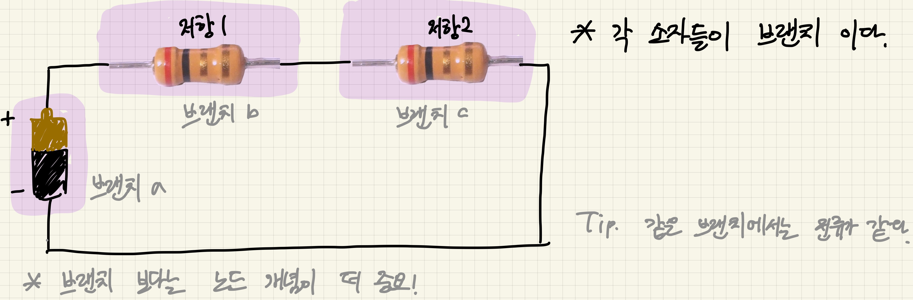</center>

<center>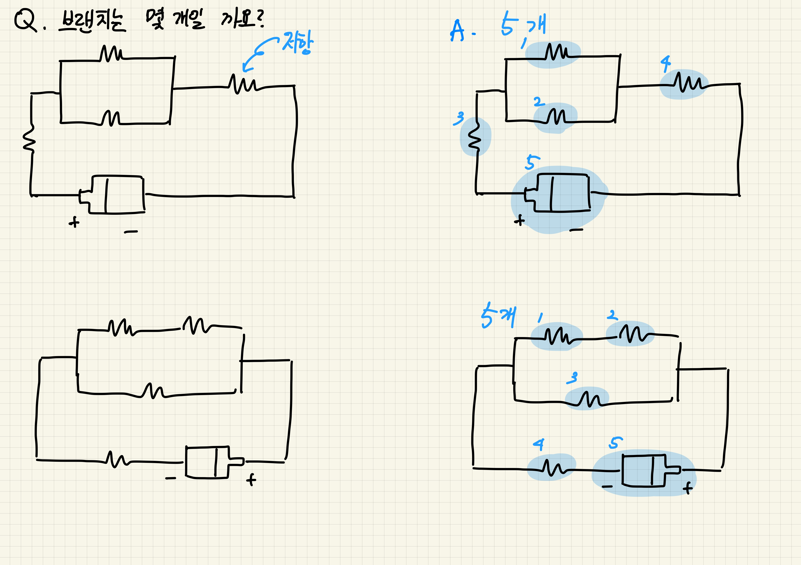</center>

노드는 브랜치와 브랜치(소자와 소자)를 잇는 연결부이다.

<center>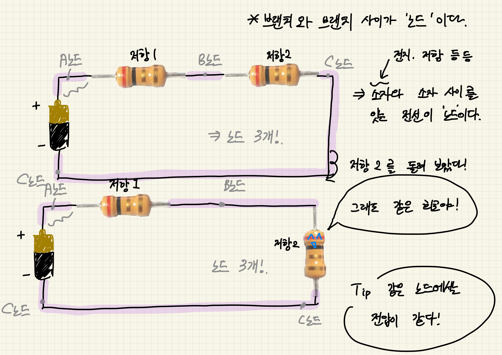</center>

<center>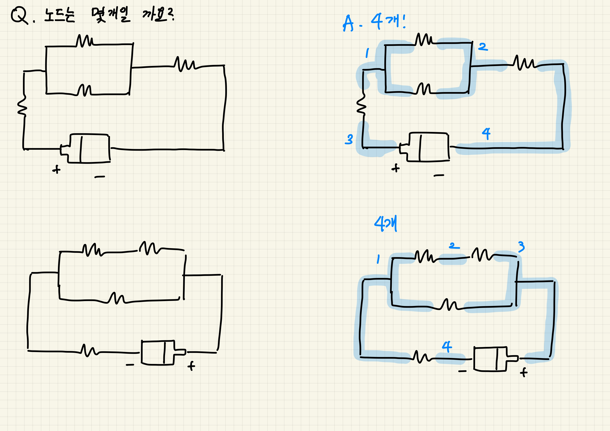</center>

[추가 참고 자료 #1](https://m.blog.naver.com/PostView.nhn?blogId=gommy313&logNo=220894737323&proxyReferer=https:%2F%2Fwww.google.com%2F)


### 브레드보드

우리는 5V를 각종 부품에 공급해주어야 한다. 하지만 아두이노에 나오는 5V 핀과 GND 핀은 그렇게 많지 않다. 그래서 우리는 5V 노드를 여러 갈래로 나누어야 하는데, 이를 도와주는 것이 브레드보드이다. 브레드보드의 각 구멍들은 금속 클립으로 한 노드로 연결되게 만들어준다. 브레드 보드에는 버스 영역과 IC 영역이 있는데 이 영역들은 다음 사진과 같다.

<center>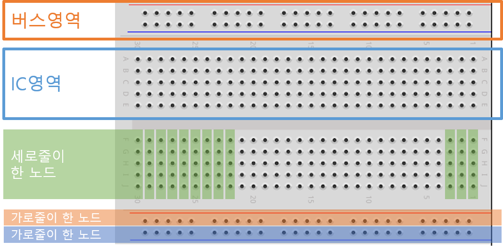</center>

브레드보드를 사용하는 이유는 다음과 같다. 배터리, 각종 소자, 아두이노의 핀은 1개~2개로 한정되어 있다. 하나의 핀(노드)에 여러 전선들을 연결해야 하는데 납땜을 하지 않는 이상 점퍼선으로 꽂아서 잇는 데에는 한계가 있다. 그럴 때 브레드보드를 사용하면 한 노드에 핀을 여러 개 꽂을 수 있어서 편리하다.

<center>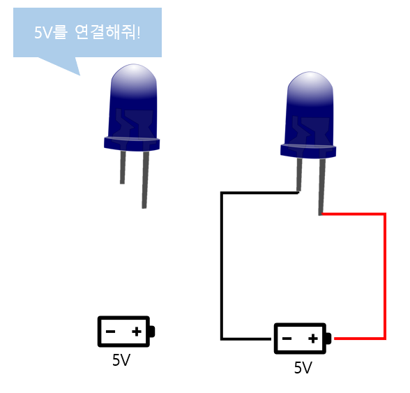</center>

배터리에 전구 하나만을 연결해야 할 때는 크게 문제가 되지 않는다. 그러나 다음과 같이 여러 개의 전구를 병렬로 연결해야 할 때에는 브레드 보드를 이용하면 좋다.

<center>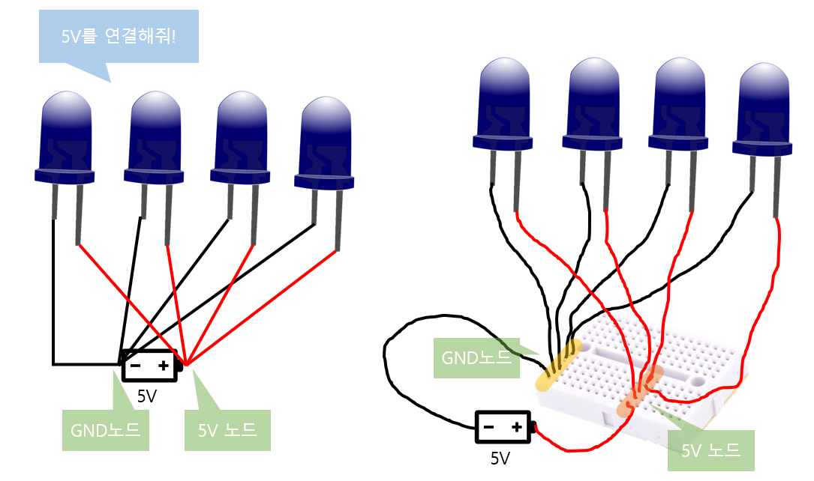</center>


## 테스트 코드 넣기

### 개발환경 구축

1. 아두이노의 [Download the Arduino IDE](https://www.arduino.cc/en/Main/Software) 페이지에 들어가서 자신의 운영체제에 맞는 Arduino IDE를 다운받는다.

<center>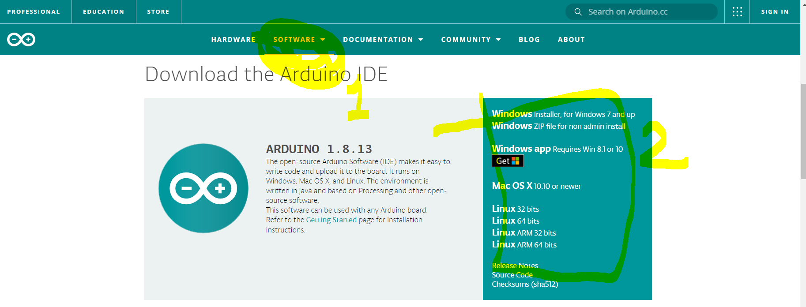</center>

2. 다운 받은 파일을 설치하고 Arduino IDE를 실행한다.

<center>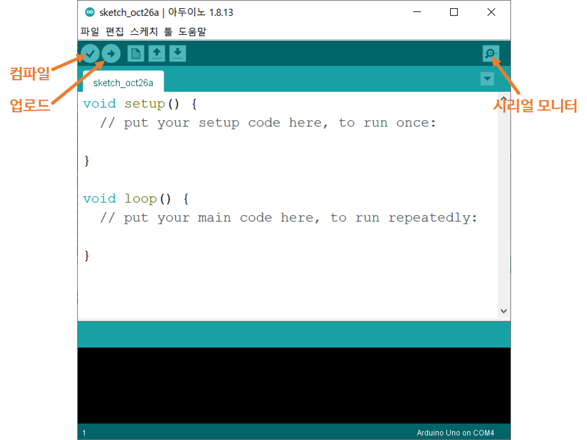</center>

### 테스트 코드 컴파일 및 업로드

1. Aruduino IDE의 코드 에디터에 [테스트 코드](./src/test_code/test_code.ino)를 붙여넣는다.
2. 컴파일 버튼을 눌러 소스코드를 컴파일한다 (동시에 파일을 저장하라는 창이 나올 수 있는데 원하는 폴더에 파일을 저장하도록 한다).
3. '툴 > 보드' 메뉴에서 'Arduino Uno'를 선택한다.
4. '툴 > 포트' 메뉴에서 'COMx (Arduino Uno)'를 선택한다. (여기서 x는 컴퓨터마다 다르다.)
5. 업로드 버튼을 눌러 소스코드를 아두이노로 업로드한다.
6. 업로드가 완료되었으면 시리얼 모니터 버튼을 눌러 테스트를 진행한다.


## setup, loop 함수
Arduino Sketch에 들어가면 기본적으로 setup 함수와 loop 함수가 적혀 있다. 아두이노가 프로그램을 실행할 때 기본적으로 가지는 틀이다. 프로그램이 시작하면 setup함수를 한 번 실행하고 그 다음에 loop함수를 반복하여 실행한다. 따라서 setup 함수 내에 프로그램이 잘 동작하기 위한 초기 설정들을 입력해 주고, loop에는 주요 내용들을 입력하면 초기설정과 주요 내용을 구분하기 쉽다. 아래 예제를 보자.

### (예제) 헤어나올 수 없는 루프속으로

**<소스 코드>**

```cpp
void setup() {
  Serial.begin(9600);         // 초기설정: 통신속도설정
  Serial.println("setup!!");
}

int num = 0;                  // 정수형 변수 num을 선언하고 0으로 초기화한다.
void loop() {
  Serial.print("loop~~~~~ ");
  Serial.println(num++);      // num의 값을 프린트하고, num에 1을 더해준다.
  delay(500);                 // 500ms = 0.5초 기다린다.
}
```
**<출력>**

```
setup!!
loop~~~~~ 0
loop~~~~~ 1
loop~~~~~ 2
loop~~~~~ 3
loop~~~~~ 4
...
```
<u>**시리얼 모니터를 열어 출력 결과를 확인**</u>해보자. setup!!은 처음에 한 번만 출력되고 "loop\~\~\~\~ 숫자"는 계속 출력된다. setup함수가 처음에 한 번 실행되고 그 후에는 loop함수가 계속 실행됨을 알 수 있다.

### 더 해보기

- `Serial.println(num++);`를 `Serial.println(num);`로 바꿔본다.

  ​	"loop\~\~\~\~ 0"이 반복해서 출력된다. num++을 해주지 않아서 num 값이 증가하지 않고 계속 0으로 유지된다.

- `Serial.println(num++);`를 `Serial.print(num++);`로 바꿔본다.

  ​	"loop\~\~\~\~ 숫자" 가 계속 출력된다. 숫자는 0부터 1씩 증가한다. 그러나 줄 나눔이 되지 않아서 "loop\~\~\~\~ 숫자"가 한 줄에 이어서 출력된다.

- `delay(500);`을 `delay(1000);`으로 바꿔본다.

  ​	"loop\~\~\~\~ 숫자"의 출력 주기가 1초가 된다. delay()함수는  입력 시간동안 기다린다. 단위는 ms단위이므로 delay(1000)은 매 loop마다 1초를 쉰다는 뜻이다.


## digitalWrite 함수

digitalWrite와 digitalRead 함수는 HIGH, LOW 신호를 생성하고 외부로부터 입력받을 수 있는 함수이다. digitalWrite 함수는 HIGH 또는 LOW 값을 디지털 핀에 출력하는데 그 전에 pinMode 함수를 통해 해당 디지털 핀을 OUTPUT으로 설정해야 한다.

```cpp
pinMode(10, OUTPUT); // 10은 아두이노의 10번 디지털 핀을 의미한다.
```

그리고 난 다음 digitalWrite 함수를 다음과 같이 사용하면 해당 핀에 5V를 발생시킬 수 있다.

```cpp
digitalWrite(10, HIGH); // 10번 핀에 5V 신호 발생
```

`HIGH` 대신에 `LOW`를 쓰면 해당 핀에 0V를 발생시킬 수 있다. 

```cpp
digitalWrite(10, LOW); // 10번 핀에 0V 신호 발생
```

다음 예제를 통해 더 자세히 알아보자.


### (예제) 아두이노 내장 LED 작동시키기

<center>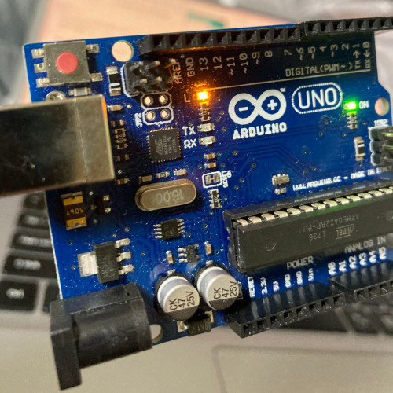</center>

위의 사진에서 붉은 빛은 아두이노 우노에 내장되어 있는 LED에서 나오는 빛이다. 아두이노 내장 LED는 13번 핀으로 제어할 수 있다. 아두이노 우노의 GND에 LED의 짧은 다리가 연결되어 있고 긴 다리가 13번 핀에 연결되어 있다고 생각하면 된다. 따라서 13번 핀을 HIGH 상태로 만들면 5V와 GND 사이의 전위가 생성되어 전류가 흘러 LED가 작동한다. 반면에 13번 핀을 LOW 상태로 만들면 LED 양단의 전위차가 0이 되므로 전류가 흐르지 않아 LED가 작동하지 않는다. 다음 코드는 아두이노 내장 LED를 일정 주기마다 켰다 껐다 하는 코드이다.

```cpp
void setup() {
  pinMode(13, OUTPUT);
}

void loop() {
  digitalWrite(13, HIGH);
  delay(500);
  digitalWrite(13, LOW);
  delay(500);
}
```

* 고찰
  - HIGH 신호일 때 왜 LED는 빛이 날까?
  - LOW 신호일 떄 왜 LED는 빛이 나지 않을까?
  - `delay(500);`에서 500을 원하는 시간으로 바꾸어 보자.
  - `delay(500);`을 `delay(1);`으로 바꾸어 보자, LED의 밝기가 왜 낮아졌을까?


### (예제) 부저를 일정 주기마다 소리내기

부저에는 능동 부저와 수동 부저가 있다. 능동 부저는 전위차만 형성시켜주면 소리가 나는 반면 수동 부저는 5V와 0V의 전위차를 주기적으로 발생시켜야 소리가 나온다. 스피커의 원리와 똑같다. 우리는 수동 부저를 이용할 것이다. 수동 부저의 한쪽에 13번 핀에, 나머지 한쪽에는 GND 핀에 연결한다. 어느쪽에 GND 핀을 연결하든 상관이 없다. 5V와 0V의 전위차를 주기적으로 발생시키기만 하면 되기 때문이다.

<center>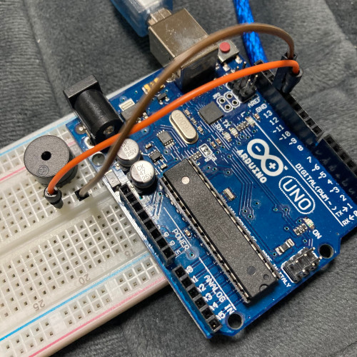</center>

```cpp
void setup() {
  pinMode(13, OUTPUT);
}

void loop() {
  digitalWrite(13, HIGH);
  delay(1);
  digitalWrite(13, LOW);
  delay(1);
}
```

놀랍게도 아두이노 내장 LED를 켰다 껐다 하는 코드와 매우 흡사하다. 전위차를 발생시키는 것이 빛을 만들어 내기도 하고 소리도 만들어 낸다는 것이 흥미롭다.

* 고찰

  - `delay(1);`에서 1을 2로 늘려보고, 4로 늘려보자 왜 음이 점점 낮아질까?

  - 아래의 코드를 업로드 해보자

    ```cpp
    void setup() {
      pinMode(13, OUTPUT);
    }
    
    void loop() {
      digitalWrite(13, HIGH);
    }
    ```

    소리가 나지 않는 이유는 무엇일까?


### 더 해보기

* 우리 라인트레이서에 digitalWrite 함수를 어디에 사용할 수 있을까?
* 아두이노 tone() 함수에 대해 알아보자. [레퍼런스 링크](https://www.arduino.cc/reference/ko/language/functions/advanced-io/tone/)


## digitalRead 함수

digitalRead 함수는 지정한 디지털 핀에서 값(HIGH 또는 LOW)을 읽는 함수이다. digitalRead 함수를 사용하기 전에 `pinMode` 함수를 통해 해당 핀의 설정을 해주어야 한다.

```cpp
pinMode(12, INPUT); // 12번 핀은 INPUT 모드로 설정
```

그 후에 digitalRead 함수를 사용하면 해당 핀에 어떤 값이 들어오는지 확인할 수 있다.

```cpp
digitalRead(12); // 함수의 반환값으로 0또는 1이 반환된다.
```


### (예제) 어라 이게 왜 안되지?

그렇다면 스위치를 가지고 스위치가 눌렸는지 시리얼 모니터로 확인하자. 스위치의 한쪽에는 5V를 연결하고 나머지 한쪽에는 아두이노의 12번 핀에 연결한다.

<center>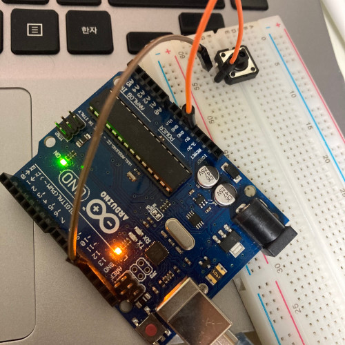</center>

그렇다면 스위치가 열린 상태에서는 12번 핀에는 LOW 신호가, 스위치가 닫힌 상태에서는 HIGH 신호가 들어와야 할 것이다. 아래는 위의 내용을 구현한 코드이다.

```cpp
void setup() {
  Serial.begin(9600);
  pinMode(12, INPUT);
}

void loop() {
  Serial.println(digitalRead(12));
  delay(500);
}
```

코드를 넣고 업로드를 한 뒤에 버튼을 눌러보며 시리얼 모니터로 버튼이 눌렸는지 확인해보자. **그런데 제대로 동작하지 않는 모습을 볼 수 있다.** 아마도 어느 순간부터 스위치를 누르든 말든 간에 일정한 값이 출력될 것이다.


### 플로팅 상태와 pull-up/pull-down 저항

디지털 회로에서 스위치를 사용하려면 pull-up 저항과 pull-down 저항이 필요하다. pull-up 저항과 pull-down 저항은 회로의 플로팅 상태를 방지하는데 사용된다. 플로팅 상태란 입력 핀에 들어오는 신호가 HIGH인지 LOW인지 구분이 안되는 상태를 의미한다. 아까 위의 예제를 다시 살펴보자.

<center></center>

스위치가 닫혔을 때에는 12번 핀에 5V가 들어간다. 그러나 스위치가 열렸을 때에는 어떤 상태인지 아두이노 입장에서 알 수 있을까? 이처럼 5V인지, 0V인지 알 수 없는 상태, 즉 플로팅 상태로 인해 스위치가 제대로 동작하지 않는 것이었다. 그렇다면 이를 어떻게 해결할 수 있을까? 이는 pull-down 저항이나 pull-up 저항을 스위치 주변에 달아서 해결할 수 있다. pull-down 저항은 다음과 같이 구성할 수 있다.

<center>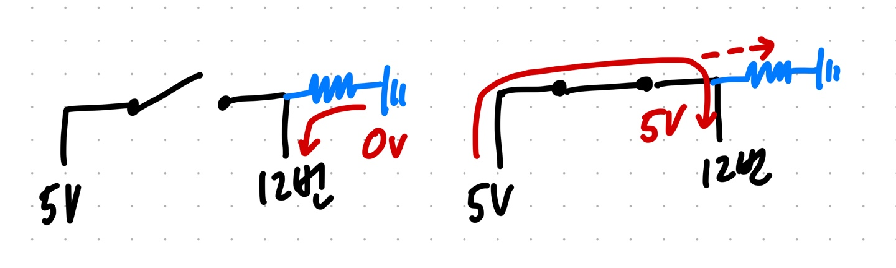</center>

스위치를 5V 쪽으로 연결할 때에 pull-down 저항을 이용한다. 위의 회로도를 보면 스위치가 열렸을 때에는 12번과 GND가 연결되어 12번이 강제로 0V가 되는 효과를 볼 수 있다. 이때 저항을 다는 이유는 회로 보호를 위해서이다. 한편, 스위치가 닫혔을 때에는 5V와 12번 핀이 연결되어 12번 핀에는 HIGH 신호가 들어가게 된다. 이때 의문이 생길 수 있는게 12번이 5V와 0V에 동시에 연결되어 있는데 왜 5V가 인식되는 것일까? 바로 GND에 연결되어 있는 저항때문이다. 전류는 저항이 낮은 쪽으로 이동하려 하기 때문에 상대적으로 저항이 큰 GND 쪽으로 전류가 흐르지 않고 상대적으로 저항이 작은 12번 핀으로 전류가 흐르게 된다. 이때 GND에 달린 저항이 pull-down 저항이라고 명명된 이유는 해당 저항이 입력 핀의 초기값을 0V로 내리기 때문이다.

<center>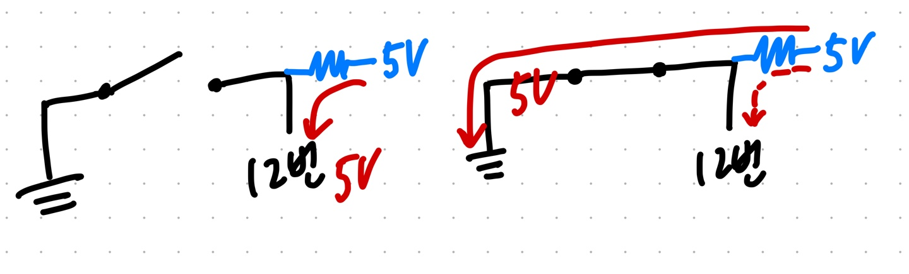</center>

이번에는 스위치를 GND 쪽에 연결하는 경우를 살펴보자. 이때는 pull-up 저항을 사용한다. 위의 회로도를 보면 스위치가 열렸을 때에는 12번과 5V가 연결되어 12번 핀에는 5V가 입력된다. 이때도 저항을 다는 이유는 회로 보호의 목적이다. 스위치가 닫혔을 때에는 5V와 GND가 바로 연결되어 12번 핀에는 전류가 흐르지 않게 된다. V=IR 공식에 의해 I가 0에 가까워지면 V도 0에 가까워지기 때문에 12번 핀은 LOW 신호로 인식되게 된다. pull-up 경우에도 마찬가지로 12번 핀은 5V와 GND에 동시에 연결되어 있지만, 상대적으로 저항이 큰 12번에는 전류가 흐르지 않게 되고 상대적으로 저항이 작은(도선의 저항) GND쪽으로 전류가 흐르게 된다. 5V에 연결된 저항이 pull-up 저항이라고 명명된 이유는 해당 저항이 입력 핀의 초기값을 5V로 올려주기 때문이다.


### (예제) 아두이노 내장 pull-up 저항

앞에서 스위치를 이용하기 위해서는 pull-up 저항 또는 pull-down 저항이 필요하다는 것을 알게되었다. 아두이노에는 pull-up 저항이 내장되어 있다. 우리는 따로 저항을 달아줄 필요 없이 아두이노에 있는 내장 pull-up 저항을 이용하면 된다.

```cpp
pinMode(12, INPUT_PULLUP); // 12번 핀을 입력 핀으로 설정하고 pull-up 저항에 연결하라
```

아두이노 내장 pull-up 저항을 이용하는 방법은 간단하다. `pinMode` 함수에서 두 번째 인자로 `INPUT` 대신에 `INPUT_PULLUP`을 입력해주면 된다. 그러면 아두이노 내부적으로 12번 핀에 pull-up 저항이 연결되어 기본적으로 5V의 값이 들어가게 된다. 아래의 코드를 업로드하여 시리얼 모니터로 확인해보자. 이때 연결해뒀던 스위치는 제거한다.

```cpp
void setup() {
  Serial.begin(9600);
  pinMode(12, INPUT_PULLUP);
}

void loop() {
  Serial.println(digitalRead(12));
  delay(500);
}
```

시리얼 모니터로 결과를 확인해보면 계속 1이 뜨는 것을 확인할 수 있다.


### (예제) 스위치로 LED 제어하기

앞에서 설명했듯이 pull-up 저항을 이용하기 위해서는 스위치의 한쪽에는 GND를 연결해주어야 한다. 따라서 이전 예제의 스위치 회로를 살짝 바꾸어 한쪽에 5V를 연결했던 노드를 GND에 연결시키자. 이때 나머지 한쪽은 그대로 12번 핀에 연결되어 있다. 그리고 "아두이노 내장 pull-up 저항" 예제 코드를 업로드하고 시리얼 모니터를 켜보자. 그리고 스위치를 눌러보며 값이 제대로 뜨는지 확인하자. 이때 주의할 점은 스위치가 열렸을 때에는 값이 1이고 스위치가 눌렸을 때에는 0이다. pull-up 저항의 기본 원리를 떠올리면 쉽게 그 이유를 알 수 있다. 스위치가 제대로 동작하는지 확인했으면 다음 코드를 살펴보자.

```cpp
void setup() {
  pinMode(13, OUTPUT);
  pinMode(12, INPUT_PULLUP);
}

void loop() {
  digitalWrite(13, digitalRead(12));
}
```

이전에는 digitalWrite의 두 번째 인자로 LOW 또는 HIGH 둘 중 하나의 값을 입력해주었지만, 이번에는 스위치의 상태값을 입력해주었다. 따라서 스위치를 누르면 0이 들어가 아두이노 내장 LED가 꺼지고 스위치를 열면 1이라는 값이 들어가 LED가 켜지게 된다.

* 고찰
  - 스위치를 눌렀을 때 LED가 켜지게 할 수 없을까? (단, 회로는 변경하지 않는다.)


### 더 해보기

* 스위치를 이용해서 카운터를 만들어보자. 스위치를 누르면 숫자가 1씩 증가해 시리얼 모니터에 띄워보자.


## 조건문

### (예제) 스위치와 부저를 이용해 피아노 만들기


## 반복문 (for문)


### (예제) ?


### 더 해보기


